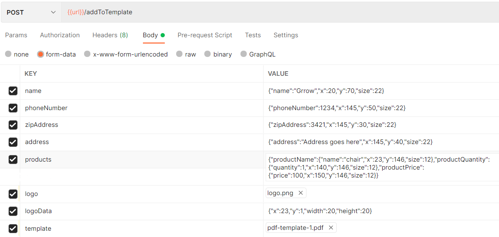

# Please check swagger for models

## GeneratePDF1 is for developing Template 1 from sctatch and does not have any coordinate positioning system

## GeneratePDF is generating PDF by specifying the coordinates.

#### cURL request

`curl --location --request POST 'localhost:3000/addToTemplate' \ --form 'name="{\"name\":\"Grrow\",\"x\":20,\"y\":70,\"size\":22}"' \ --form 'phoneNumber="{\"phoneNumber\":1234,\"x\":145,\"y\":50,\"size\":22}"' \ --form 'zipAddress="{\"zipAddress\":3421,\"x\":145,\"y\":30,\"size\":22}"' \ --form 'address="{\"address\":\"Address goes here\",\"x\":145,\"y\":40,\"size\":22}"' \ --form 'products="{\"productName\":{\"name\":\"chair\",\"x\":23,\"y\":146,\"size\":12},\"productQuantity\":{\"quantity\":1,\"x\":140,\"y\":146,\"size\":12},\"productPrice\":{\"price\":100,\"x\":150,\"y\":146,\"size\":12}}"' \ --form 'products="{\"productName\":{\"name\":\"chair\",\"x\":23,\"y\":152,\"size\":12},\"productQuantity\":{\"quantity\":1,\"x\":140,\"y\":152,\"size\":12},\"productPrice\":{\"price\":100,\"x\":150,\"y\":152,\"size\":12}}"' \ --form 'logo=@"PATH_TO_LOGO/logo.png"' \ --form 'logoData="{\"x\":23,\"y\":1,\"width\":20,\"height\":20}"' \ --form 'template=@"PATH_TO_TEMPLATE/pdf-template.pdf"'`

#### POSTMAN request

 

